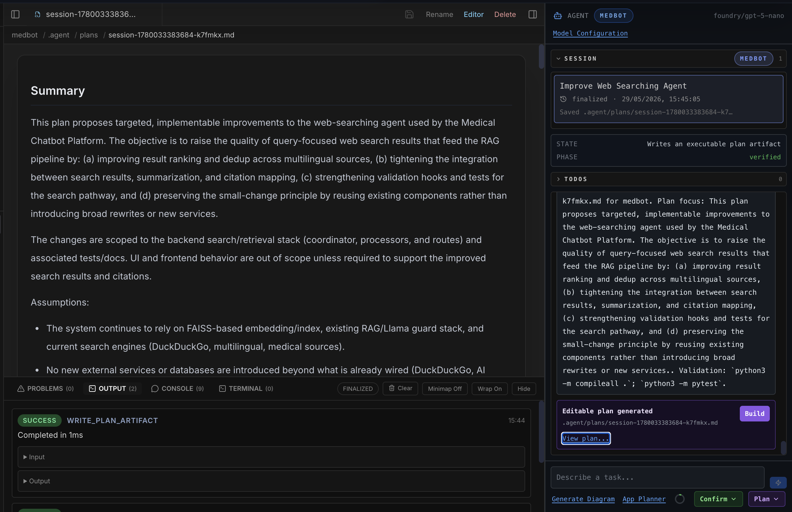
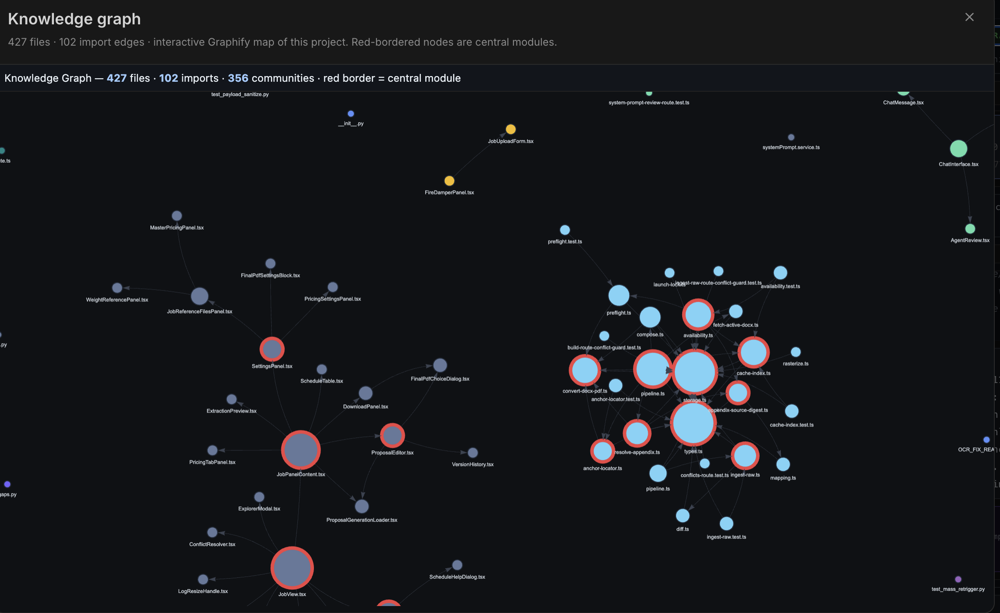

<div align="center">

# Codoptic

### Diagram-as-code, repo-aware AI architect, and agentic coding workspace — all running on your machine.

[](LICENSE)
[](#privacy-first-by-design)
[](docs/providers.md)
[](https://discord.gg/y77MGTJ2v)

**[Quick Start](#quick-start) · [Documentation](#documentation) · [Discord](https://discord.gg/y77MGTJ2v)**

</div>

---

Codoptic is an open-source workspace that turns any repository into **live architecture diagrams**, an **agentic code planner**, and a **reviewable coding agent** — without leaving your machine. Drop it inside the repo you want to understand, point it at the AI provider you trust, and ship faster with full visibility into every step the agent takes.

<p align="center">
  
</p>

---

## Why Codoptic

- **Understand any codebase in minutes.** Scan a repo locally and get a layered architecture diagram you can edit, export, and trust.
- **Plan before you patch.** A visible plan, TODO list, and clarification gate sit between every prompt and every change.
- **Review every diff.** Patches are previewed, validated against the project's real test commands, and only applied with your approval.
- **Local-first by design.** Your code never leaves your machine except for the AI prompts you choose to send.
- **Bring your own model.** OpenAI, Anthropic, Gemini, Grok, Mistral, DeepSeek, NVIDIA NIM, and Azure AI Foundry — switch at any time.

## What's Inside

<table>
<tr>
<td width="50%" valign="top">

### Diagram Editor

A live diagram-as-code editor backed by a compact DSL. Type or paste, render instantly, inspect nodes and edges, and export to PNG, SVG, JSON, or PDF.

> What you see is exactly what you export — same SVG scene, same theme, same bounding boxes.

</td>
<td width="50%" valign="top">

### Repo Explorer

Point Codoptic at a folder and it produces single- or multi-layer architecture diagrams from your actual code, complete with subsystem clustering and inferred edges.

> Designed to live alongside your project so the default repo path is always your codebase.

</td>
</tr>
<tr>
<td width="50%" valign="top">

### Code Space — Agentic Coding

A reviewable coding agent with **Ask**, **Plan**, and **Code** modes. Watch the agent inspect the repo, draft a plan, propose patches, and run validation — every step visible.

> Two trust gates: a clarification gate before planning and a pre-validation diff gate before execution.

</td>
<td width="50%" valign="top">

### Knowledge Graph

On the first plan run, Codoptic builds an offline AST/import knowledge graph and uses its "god nodes" to bias context selection. Open the **Knowledge graph** link to explore your codebase as an interactive map.

> Runs offline. No semantic API call required.

</td>
</tr>
</table>

## See It In Action

<p align="center">
  
  
</p>
<p align="center"><i>Agentic planner with visible reasoning · Approval-gated patches with full diff preview</i></p>

<p align="center">
  
</p>
<p align="center"><i>Interactive code knowledge graph — central modules surface as hubs</i></p>

## Quick Start

Codoptic is designed to live **inside the repo you want to analyze**:

```bash
git clone https://github.com/Codoptic/Codoptic.git path/to/your-project/Codoptic
cd path/to/your-project/Codoptic
cp .env.local.example .env.local      # add a provider key
npm install
npm run dev
```

Open <http://localhost:3000>. The agentic explorer defaults to the parent of `Codoptic/`, so the project you cloned into is the one you'll analyze.

> Need more detail (env vars, scripts, security notes, repo layout)? See [docs/local-setup.md](docs/local-setup.md).

## Bring Your Own AI

Any single key gets you started. Switch providers in the UI any time.

| OpenAI | Anthropic | Gemini | Grok | Mistral | DeepSeek | NVIDIA NIM | Azure AI Foundry |
| :-: | :-: | :-: | :-: | :-: | :-: | :-: | :-: |
| `OPENAI_API_KEY` | `CLAUDE_API_KEY` | `GEMINI_API_KEY` | `GROK_API_KEY` | `MISTRAL_API_KEY` | `DEEPSEEK_API_KEY` | `NVIDIA_API_KEY` | `FOUNDRY_API_KEY` |

Full provider matrix, retry semantics, and validation flow: [docs/providers.md](docs/providers.md).

## Privacy First, By Design

- Repo scanning happens **server-side on your machine**.
- The scanner honors `.gitignore` and refuses obviously sensitive paths and file types (`.env*`, `*.pem`, `*.key`, …).
- AI requests send **selected chunks and per-file summaries**, not your entire repository.
- Cached summaries live in `.codoptic-cache/` and are git-ignored.
- API keys entered in the UI live only in server-process memory for the current session.

## Documentation

| Doc | What's inside |
| --- | --- |
| [docs/local-setup.md](docs/local-setup.md) | Installation, `.env.local`, scripts, security notes |
| [docs/code-space.md](docs/code-space.md) | Agentic coding workspace, modes, runtime, review gates, knowledge graph |
| [docs/dsl-grammar.md](docs/dsl-grammar.md) | DSL syntax, identifier rules, properties, edge kinds, examples |
| [docs/providers.md](docs/providers.md) | Provider matrix, models, JSON-mode, retry contract |
| [docs/architecture.md](docs/architecture.md) | System architecture, AI pipeline, design choices |

## Community

Building, breaking, or just curious? Come say hi on **[Discord](https://discord.gg/y77MGTJ2v)** — we share roadmap updates, demos, and early features there first.

## License

MIT — see [LICENSE](LICENSE).
